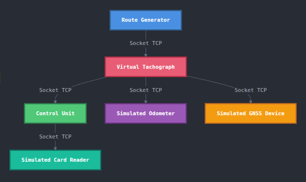

# TachoTrack - Digital Tachograph Simulation System

## Project Structure

This project simulates a digital tachograph system with cloud integration through two main components:

### 1. Virtual Tachograph (`/VirtualTachograph`)

The Virtual Tachograph simulates a complete digital tachograph system using interconnected Docker containers:

#### Components

##### Control Unit
- Central management component
- Handles communication between all components
- Connects to cloud MQTT broker
- Processes and validates data from sensors
- Manages driver card authentication
- Generates events and warnings

##### Card Reader
- Simulates driver card insertion/removal
- Random simulation of different drivers
- Communicates card status to Control Unit
- Supports multiple driver IDs

##### GPS/GNSS System
- Simulates vehicle positioning
- Provides real-time coordinates
- Calculates GPS-based speed
- Follows routes from Route Generator

##### Odometer
- Simulates vehicle speed measurements
- Provides independent speed data
- Allows comparison with GPS speed
- Supports variable sampling rates

##### Routes Generator
- Creates realistic route simulations
- Uses Google Routes API
- Generates:
  - GPS coordinates
  - Speed profiles
  - Journey durations
  - Route segments

#### Network Architecture



#### Container Communication
- Internal network: `simulator_network`
- Control Unit port: 5000
- GPS port: 5000
- Odometer port: 6000
- MQTT port: 1883 (external)

#### Development Setup

1. Add your Google Routes API key in VirtualTachograph/RoutesGenerator/code/GenerateRoutes.py (line 23):
```bash
'X-Goog-Api-Key':'your_api_key_here'
```

2. Build and run containers:
```bash
cd VirtualTachograph
docker compose build
docker compose up -d
```

3. Check container status:
```bash
docker compose ps
```

4. View logs:
```bash
# All containers
docker compose logs -f

# Specific container
docker compose logs -f tachograph_control_unit
```

5. Stop simulation:
```bash
docker compose down
```

#### Data Flow
1. Route Generator creates journey simulation
2. Position data sent to GPS simulator
3. Speed data sent to Odometer simulator
4. Card Reader simulates driver presence
5. Control Unit:
   - Collects all sensor data
   - Validates measurements
   - Detects events (speeding, no driver, etc.)
   - Sends data to cloud via MQTT

#### Configuration Options
- Sampling frequencies adjustable
- Route endpoints configurable
- Speed variation parameters
- Event detection thresholds
- MQTT connection settings

### 2. IoT Cloud Services (`/IoTCloudServices`)

Cloud infrastructure including:
- Message Router (MQTT)
- Microservices:
  - Devices
  - Sessions 
  - Telemetry
  - Events
- Web Application:
  - Frontend UI
  - Backend API
- Database (MariaDB)

## Getting Started

### Prerequisites
- Docker and Docker Compose
- Python 3.11+
- Mosquitto MQTT client (for testing)

### Running the System

1. Start Cloud Services:
```bash
cd IoTCloudServices
./cloud.sh
```

2. Launch Virtual Tachograph:
```bash
cd VirtualTachograph
docker compose up -d
```

3. Access web interface:
```
http://localhost
```

## Testing

### MQTT Testing
```bash
# Subscribe to all topics
mosquitto_sub -h localhost -t "#" -v -u fic_server -P fic_password

# Publish test message
mosquitto_pub -h localhost -t "fic/tachographs/tachograph_control_unit-1/request_access/" \
  -m '{"tachograph_id": "tachograph_control_unit-1"}' \
  -u fic_server -P fic_password
```

### API Testing
```bash
# Get active tachographs
curl http://localhost:5001/tachographs/

# Register new tachograph
curl -X POST http://localhost:5001/tachographs/ \
  -H "Content-Type: application/json" \
  -d '{"tachograph_id": "tachograph_control_unit-1"}'
```

## Architecture

- Docker containerization
- MQTT messaging protocol 
- REST APIs
- MariaDB database
- Web-based visualization

## License

This project is licensed under the MIT License.
